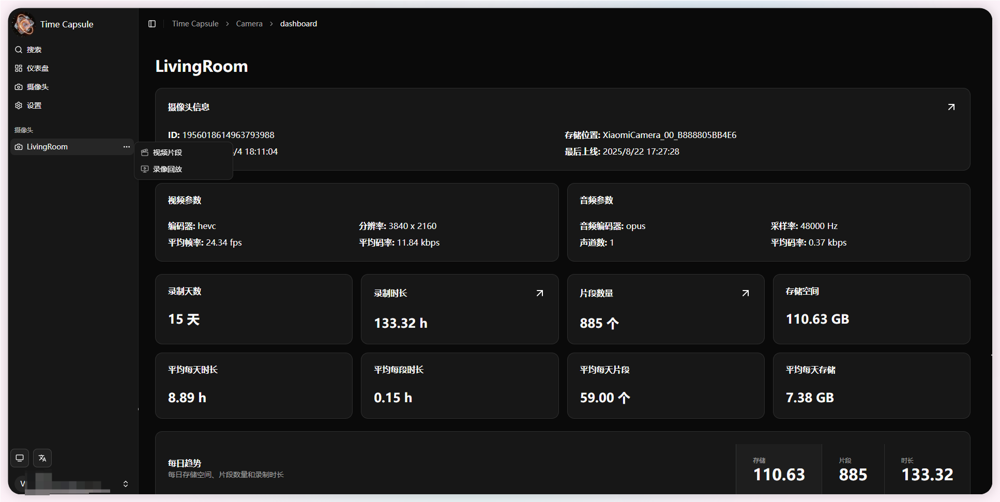

## 关于本项目
- 🎯 本项目是一个开源的录像管理与回放应用
- 🗂️ 主要用于管理存储在NAS或本地的散乱监控视频
- 🌐 支持Web端操作，支持多平台访问

## 功能概览
- 📹 摄像头管理：添加、修改、删除摄像头，支持视频存储路径与文件命名模板
- 🎬 视频片段管理：按时间、摄像头查看视频片段，支持缩略图浏览
- ⏯️ 回放功能：支持拖动时间轴、倍速播放、日期跳转等功能
- 🔄 自动同步：定时或手动同步视频元数据及缩略图缓存
- 🔍 YOLO目标检测：支持自动检测并标记视频中的目标
- 🔑 权限管理：支持用户、角色及OIDC登录，实现灵活权限控制
- ⚙️ 配置与部署：支持Docker Compose快速部署，也可源码部署，自定义环境变量配置

## 安装
- 📦 查看[部署文档](../deploy/)完成安装

## 添加摄像头
- 📹 查看[添加摄像头](./cameras/#添加摄像头)添加一个摄像头
- 🔄 等待系统自动同步元数据，或[手动触发同步](./cameras/#手动同步)

## 查看视频片段或回放
- 在`📋 摄像头列表`中找到刚添加的摄像头，点击进入该摄像头的`📊 Dashboard`页面
- 在`Dashboard`页面可以点击`⏱️ 录制时长`，进入`📼 录像回放`页面，拖动时间轴查看历史录像
- 在`Dashboard`页面可以点击`🎬 片段数量`，进入`📂 视频片段`页面，查看所有视频片段

## 页面截图

